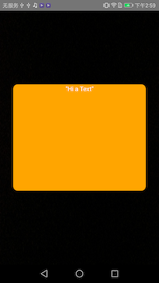

# View render issue when using surfaceview in react-native

There is a compatible render issue when using surfaceview and flexbox.

When we wrap a surfaceview with container using flexbox(flex:1) style, the other view using `position:'absolute'` will not be render.

When we change the container's style to `StyleSheet.absoluteFill`, it works, but only if we do not use the `shadow style`( shadowColor: 'balck')

## Expect Result

App launch and shows a camera preview, and a yellow box in the middle of screen will be shown after 3s.

When click the yellow box, the box will be dismiss, and a `on click` string will be output in the console.

Like the picture below:

## Fail Result

The yellow box will not be shown, but when we click on the middle of screen, the `on click` string is output in the console.

It seems that `yellow box view` is layout(and it is clickable) but not render to screen.

## Test step

Just run the app to see the success case.

uncommonet the style in [index.js](./src/index.js#L23)  to see the fail case.

## Test reocrd

react-native：0.45.1

flex+surfaceview

| Phone         | System ver.| Result    |
| --------------|:----------:| ----------:|
| Nexus 5       | 5.1.1      | pass       |
| Nexus 6P      | 6.0.1      | pass       |
| Redmi 3x      | 6.0.1      | fail       |
| Galaxy Note 3 | 5.0        | fail       |
| EVA-AL00      | 7.0        | pass       |